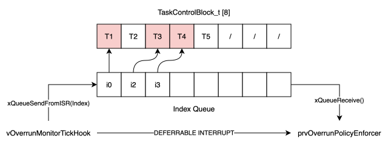
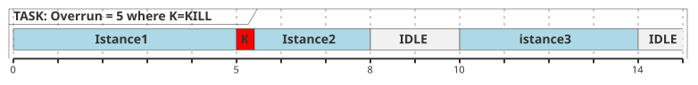
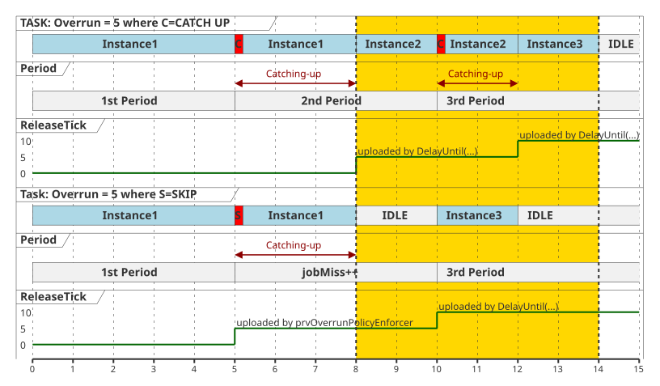
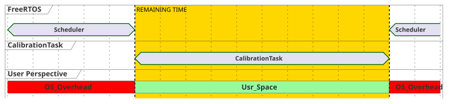
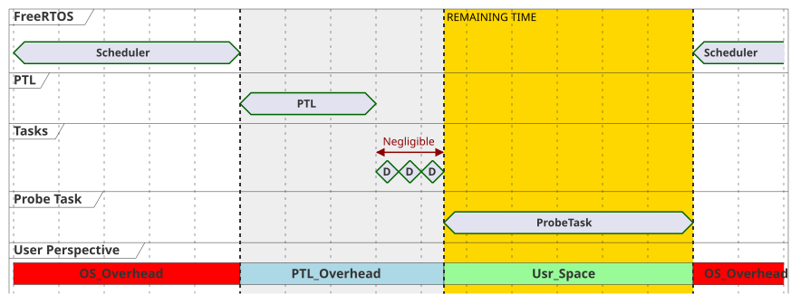
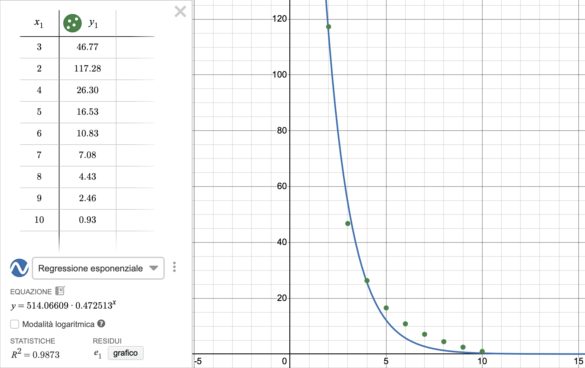

# Priority-Based Scheduler for Periodic Tasks
This project implements a Priority-Based Scheduler on FreeRTOS that supports periodic tasks (handled by the Periodic Task Layer (PTL)). The system is emulated using a QEMU emulator.

---
## Table Of Contents
0. [Usage](#0-usage)
1. [Architecture](#1-architecture)
2. [Periodic Task Layer](#2-periodic-task-layer)
3. [Memory Management](#3-memory-management)
4. [Empirical Overhead](#4-empirical-overhead)
5. [Logs](#5-logs)

---
## 0. Usage

### 0.1 Clone and Setup

To clone the repository and automatically initialize the FreeRTOS submodule, use the `--recursive` flag:

```bash
git clone --recursive https://github.com/AlessandrinoBottas/freertos-periodic-task-layer.git
cd freertos-periodic-task-layer
```

If you have already cloned the repository without the submodule, you can fetch it by running:

```bash
git submodule update --init --recursive
```

---

### 0.2 Configure Tasks

Edit the task configuration array directly in the source code:

    user_space/main.c 

**Task configuration example:**
```C
static TaskConfig_t xUserTasksConfig[] = {
    {
        .pcName = "T1",
        .uxStackDepth = 256,
        .uxPriority = 6,
        .pvTaskCode = vDummyTask,
        .pvParameters = (void*)&ulWorkload,
        .xPeriod = 10,
        .xDeadline = 10,
        .xPhase = 0,
        .ePolicy = KILL,
        .cIsPeriodic = 1
    }
};
```


---

### 0.3 Compile

    make clean && make all

This compiles the project.

---

### 0.4 Run on QEMU

    make qemu_start

---


## 1. Architecture

### 1.1 System Priority Hierarchy
The system is configured with 15 priority levels. Here we show how they are assigned:

| Priority Level | Task Category | Description |
| :---: | :--- | :--- |
| `configMAX_PRIORITIES - 1` (**14**) | **Overrun Policy Enforcement Task** | The highest priority task. It applies overrun policies to the periodic tasks. |
| **[2-13]** | **Periodic Tasks** | Hard Real-Time user tasks defined directly in `user_space/main.c`. Developers assign these priorities freely. |
| **1** | **LOGGER** | Low-priority task that logs the events. |
| `tskIDLE_PRIORITY` (**0**) | **FreeRTOS Idle Task** | The system idle task. It runs exclusively when the CPU is completely free. |

### 1.2 Task Control Block 
Each task is described by the data structure `TaskConfig_t` with all static metadata.

This datastructure is wrapped in the `TaskControlBlock_t` data structure that contains all values that will be modified runtime. This data structure is the *image* of the status of our periodic Task. As we will see in later sections this will be the data structure used for managing periodic Tasks.
```C
---task_control_block.h---
typedef struct
{
    const TaskConfig_t * xUserTask;
    TaskHandle_t pxTaskHandle;  /* Changes on every xTaskCreate() */
    TickType_t xReleaseTick;
    TickType_t xOverrunTick;
    TickType_t xDeadlineTick;
    uint8_t ucIsOverrunning;
    uint8_t ucIsRunning;        /* N.B. job running != status of the FreeRTOS Task!!!!! */
    uint32_t uiJobMiss;
    
    /* As xUserTask is declared as "const" and "xPhase" has to be reset in KILL policy, we add a xCurrentPhase attribute */
    TickType_t xCurrentPhase;           
    
    StaticTask_t * pxTCB;
    StackType_t  * pxStackBuffer;

} TaskControlBlock_t;
```


## 2. Periodic Task Layer

### 2.1 Periodic Task Wrapper
The `prvPeriodicTaskWrapper` is the function in which the task are executed. Once a task is created, its tcb gets wrapped. In the wrapper it will execute its function and update variables such as ticks and booleans.

Let's make `prvPeriodicTaskWrapper` simple:

1. From the parameter **retrieve itself** (all it's infos give as parameter) `TaskControlBlock_t *pxTCB = (TaskControlBlock_t *) pvParameters;`. This must be done since the wrapper is generic and is created for every different task.
2. Delays its execution according to initial phase.
3. Enter in the *inifite* `for(;;)`
    - Set status variables: `xOverrunTick`,`xDeadlineTick`,`ucIsRunning`,`ucIsOverrunning`
    - Logs the start
    - Executes the *user level* task
    - Set `ucIsRunning = 0;`
    - Logs the end
    - Wait until the next wake-up time

Basically this wrapper is only reporting his status by updating status variables.

The only problem is that the *wrapper has no any kind of control on itself* rather than sleeping on the next wake-up time.

This is where the **Hook Callback Function** `vOverrunMonitorTickHook`and its **deferred interrupt processing task** `prvOverrunPolicyEnforcer` come into play.

> We managed to use the `traceTASK_INCREMENT_TICK` hook function since **maximum portability** is one of the requirements. The idea behind this decision is that we didn't want to deprive the user from being able to exploit the `vApplicationTickHook` hook function made public by the FreeRTOS developers, moreover we didn't want to change the FreeRTOS `task.c` at all, avoiding the insertion of any kind of lines of code. So we managed to use a "debugging" hook for our scope. This enhances 100% portability and also highly reduces the intrusion into the user level space.

Since the `vOverrunMonitorTickHook` runs into a ISR context is light and fast. Check *every single* overrun tick of all the *suitable* tasks and if a policy must be applied it will push the ID of the task into a queue and then enables the **deferrable interrupt mechanism** by executing `portYIELD_FROM_ISR( xHigherPriorityTaskWoken );`.

This last instruction will wake up `prvOverrunPolicyEnforcer` that is in a blocked state on the ID's queue.

Basically `prvOverrunPolicyEnforcer` waits for any taskID that is overruning, and it wakes up when 
`vOverrunMonitorTickHook` find one or more of them.



> The of having an **array** of `TaskControlBlock_t` and go through all of them is 'ok' since from the requirements \#Tasks $\ge8$. For ID we are referring to the index of the `TaskControlBlock_t` array. This solution is not scalable BUT with little modification same results can be achieved by using a queue of ready tasks and passing it's `TaskControlBlock_t` to the `prvOverrunPolicyEnforcer`

### 2.2 Policy Enforcement
The policies are handled by the `prvOverrunPolicyEnforcer`, which upon receiving a notify it checks and applies the policy to the time-exceeding task and raises and records the event.
- **KILL**: the task gets deleted and then recreated


- **CATCH UP**: the task's status variable `ucIsOverrunning` is set to 1. This will let the task run and be invisible to the `vOverrunMonitorTickHook` *until he CATCHes UP*.
- **SKIP**: job miss counter is increased and the **time window** is shifted. This allow to shift the starting time, hence when the task will be finished the wrapper will wait unitl the shifted starting tick. This creates a **"hole"** in the scheduling that is not present in the Catch Up.
```C
case SKIP:
    pxTCB->uiJobMiss++;
    /* Sliding window */
    pxTCB->xReleaseTick = pxTCB->xOverrunTick;
    pxTCB->xOverrunTick = pxTCB->xReleaseTick + pxTCB->xUserTask->xPeriod;
    break;
```




## 3. Memory Management

To guarantee deterministic execution and make memory management safer this architecture completely discards dynamic heap allocation. Instead, it enforces a strict **static allocation** paradigm. The following sections detail the mechanisms, software tools, and kernel configurations deployed to securely manage the system's memory layout.

### 3.1 Advantages of Disabling Dynamic Allocation
Dynamic memory provisioning (using standard malloc or FreeRTOS functions like pvPortMalloc) presents two risks for RTOS: **heap fragmentation** and **non-deterministic execution**. During execution, fragmentation can lead to allocation failures despite having adequate total free memory. Additionally, the variable time required to locate an available memory block fundamentally breaks real-time predictability.
By setting `configSUPPORT_DYNAMIC_ALLOCATION` to 0 in `FreeRTOSConfig.h`, the dynamic heap manager is entirely removed. All kernel objects, Task Control Blocks, task stacks, and queues are allocated statically. This allows memory usage to be verified at link time.

### 3.2 Memory Protection and the 'const' Qualifier
Memory integrity and robustness against data corruption are actively enforced through both hardware offloading and active kernel monitoring:

* **`const` qualifier:** All generated task configuration structures (such as the task arrays) are declared using the C `const` keyword. This allows the compiler to put these objects into `.rodata`, which are mapped by the linker script into the microcontroller's FLASH memory. Consequently, task configuration data remain immutable throughout execution, preventing accidental or unauthorized modification while reducing SRAM usage.

* **xPhase attribute:** Because task configuration structures are stored in read-only memory, their fields cannot be modified during execution. To support runtime scheduling, the initial activation offset (`xPhase`) is preserved as an immutable configuration parameter, while the runtime value (`xCurrentPhase`) is stored separately inside the corresponding `TaskControlBlock_t`. This separation prevents the scheduler from attempting to modify data residing in read-only FLASH memory.

* **Const Pointer for Task Configurations:** Within `TaskControlBlock_t`, the task configuration is referenced through a pointer declared as `const TaskConfig_t *xUserTask`. This denotes a pointer to constant data, ensuring that the configuration object cannot be modified through this reference. Since the referenced `TaskConfig_t` instances are stored in the read-only `.rodata` section (mapped to FLASH by the linker), this qualifier provides compile-time protection against accidental writes to immutable task parameters such as `xPeriod`, `xDeadline`, and `uxPriority`.

* **Kernel Overrun Protection:** To catch execution bugs before they cause silent data corruption in adjacent memory regions, stack sanity is monitored via FreeRTOS runtime hooks. Activating stack overflow checking via `configCHECK_FOR_STACK_OVERFLOW` in `FreeRTOSConfig.h` allows the kernel to intercept tasks that breach their pre-allocated boundaries, immediately halting the system.

### 3.3 Role of `static_kernel_functions.c`
When dynamic memory allocation is fully disabled, the FreeRTOS kernel loses its native ability to automatically provision memory for its own internal system tasks. Consequently, the program itself is required to explicitly supply the memory buffers needed for these baseline functions.

The file `static_kernel_functions.c` implements the mandatory kernel callback `vApplicationGetIdleTaskMemory()`. Within this function, static variables are defined to hold the Idle Task's Control Block (`xIdleTaskTCB`) and its dedicated execution stack array (`uxIdleTaskStack`). When `vTaskStartScheduler()` is called, the kernel invokes this hook to safely obtain the exact hardware memory addresses for the Idle Task, enabling a clean system boot without any hidden dynamic dependencies.


## 4. Empirical Overhead
In this section will be discussed the entire pipeline followed for achieving a empirical overhead evaluation of our system.

### 4.1 Hardware independent virtualization speed
Execution time is independent from the host machine's physical hardware to guarantee repeatable real-time evaluation. 

This is achieved via the Makefile QEMU parameters:
```Makefile
 qemu_start:  
    qemu-system-arm -machine mps2-an385 -cpu cortex-m3 -kernel \\
    $(ELF) -monitor none -nographic -serial stdio \\
    -icount shift=6,sleep=off
```
where `-icount shift=6` forces the QEMU clock period to $2^6 = 64 ns$. Hence $f=14.625 MHz$. Also `sleep=off` disables synchronization with the host wall-clock time.
In `FreeRTOSConfig.h`, `configTICK_RATE_HZ` is set to $1000$, yielding a deterministic scheduler resolution of $|\text{Tick}| = 1 ms$.

### 4.2 FreeRTOS Scheduling overhead


In this section we will evaluate the **FreeRTOS empirical scheduling overhead**.

This evaluation was conducted using standalone code. Below is a high-level explanation of the calibration methodology.

The calibration reflects a best-case scenario. Since `vCalibrationTask` is the only running task, the scheduler does not perform any context switches.

`vCalibrationTask`:
1. It executes a massive, deterministic *loop workload* at the highest priority while recording Starting and Ending Tick.
2. It computes the execution time ($\Delta$) as: $\Delta = \text{Ending tick} - \text{Starting tick}$.
3. By dividing the total number of iterations by this time delta, it derives the precise constant required for the main application's mathematical benchmarks:  
```C  
#define LOOPS_PER_MS  1213UL
```
### 4.3 Empirical overhead


From requirements: System overhead (PTL deadline tracking and policies application) must strictly remain $\leq 10\%$. This is empirically measured at runtime using `vOverheadProbeTask`.

---

The probe operates at the *lowest priority*. It attempts to execute a loop calibrated to take exactly $10,000 ms$ of uninterrupted CPU time. This calibration is made using the `LOOPS_PER_MS` value (calculated with the `vCalibrationTask`).

Since we know that `LOOPS_PER_MS` is the maximum amount of loops in a single tick that can be made considering FreeRTOS Scheduling best case scenario. Than we can evaluate the **overhead** introduced by out ATL and PTL layers by evaluating the $\Delta$ of the Starting and Ending tick.

$$
Overhead(\%) = \left(\frac{\Delta}{10000 ms} -1\right)\cdot100
$$

> (Critical observation) The loops that perform the worload **MUST BE THE SAME** for both `vOverheadProbeTask` and `vCalibrationTask`.

This rigorous empirical profiling guarantees deterministic operational bounds.

#### 4.4 Mathematical Model of the Profiling Tool
* $T$: Total theoretical CPU time available within a specified measurement period.
* $F$: Empirical scheduling overhead introduced by the FreeRTOS baseline.
* $PTL$: Target overhead introduced by the Periodic Task Layer logic.
* $C$: Measured CPU time dedicated strictly to payload execution during the baseline calibration (system without PTL).
* $P$: Measured CPU time dedicated strictly to payload execution during the probe task (system with PTL active).
* $\mathbb{E}[\cdot]$: Expected value function, representing the empirical average over multiple sampling iterations.

The execution time distribution for the calibration and probe phases can be modeled as follows:

$$\mathbb{E}[C] = T - F$$

$$\mathbb{E}[P] = T - F - PTL$$

By substituting the expected calibration time into the probe equation, we isolate the $PTL$ variable to compute the final expected overhead:


$$PTL = \mathbb{E}[C] - \mathbb{E}[P]$$

### 4.5 Operation boundries
The worst case scenario that can happen is a enormous amount of KILL policy that needs to be applied in a very short time.

This can be made exploting our dummy task as follow:
```C
void vDummyTask(void *pvParameters) {
    vTaskDelay(pdMS_TO_TICKS(2 * PERIOD));
}
```
With this specific configuration, the dummy task will exist and therefore scheduled, since it exist is also visible from our PTL and thus policy will be applied accordingly. Moreover it will have the minimum impact possible on the overhead becuase it will instantly call `vTaskDelay`.

Since the maximum number of task is 8, we take 8 task with all the same period and all under the KILL policy and in the following images are the results of our Tool where $x$ is the PERIOD and the $y$ is the Overhead \%:



The precision of this profiling tool is strictly bounded by the accuracy of the initial FreeRTOS scheduling calibration. Any jitter or noise captured during the baseline measurement inherently propagates to the final calculation. Furthermore, because this mathematical framework relies on expected values, the result quantifies the average systemic overhead rather than the Worst-Case Execution Time (WCET). Consequently, this empirical approach successfully identifies the system's typical operational mean, but it does not guarantee a strict deterministic upper bound for critical boundary scenarios.

### 4.6 Limitations
Something strange happen when $PERIOD=11$. The output is the following

`Target: 10000ms | Real: 9973 ms | OH: 4294967269 ms (4294.69%)`

In this case this weird result come from $\Delta = \text{Real}-\text{Target} < 0$

So it clear that this empirical method which logic is based on loops and counters is not the perfect solution. The program is limited by the micro-overhead of its own tracking functions, as executing `xTaskGetTickCount` and managing the PTL logic consumes clock cycles during the measurement window. Because these measurement delays are embedded directly within the runtime loop, obtaining perfectly precise timestamps of the task boundaries is extremely difficult. Moreover the act of measuinr overhead introduce overhead itself.

### 4.7 Future Works
For future development, adding special hooks connected directly to the hardware timer will allow us to count the exact clock cycles used by each software operation. This will overcome the resolution limits of the system tick.

**Note:** The scheduling logic and fault management models remain mathematically correct and valid. This hardware-level change would only be implemented to make the measurements more precise.


## 5. Logs
This module implements a deterministic, queue-based event logging subsystem for FreeRTOS, coupled with a bare-metal UART driver. It is designed to track task execution, overruns, and deadline misses while adhering to strict real-time and static-memory constraints.  

### 5.1 Trace Event Architecture

Every log message uses a standardized `TraceEvent_t` structure to ensure a uniform memory footprint in the queue. This struct captures the exact timing (`xTimestamp`), the executing task name (`pcTaskName`), job misses (`usJobMiss`), and deadline misses (`ucDeadlineMiss`). System behavior is explicitly categorized by the `eTraceEventType_t` enumeration, which defines standard scheduling milestones and overrun mitigation states (e.g., Kill, Skip, Catch-Up).

### 5.2 UART Driver Subsystem

To eliminate the overhead of external libraries, output is routed through a custom, bare-metal UART driver. Configured with a fixed Baud Rate divider (`UART0_BAUDDIV = 16UL`), transmission relies on deterministic, busy-wait polling. By masking the` UART_STATE_TXBF` register, the software guarantees the hardware buffer is clear before transmitting the next byte, ensuring reliable output without requiring interrupts.

### 5.3 Logger Layer (Producer-Consumer)

Logging directly to a peripheral from high-priority tasks creates unacceptable real-time latency. This architecture decouples the process: producers (tasks or ISRs) populate an event struct and push it to `xTraceQueue` with zero block time. This guarantees mission-critical execution is never delayed. A low-priority consumer (`vTracePrinterTask`) pends on this queue, waking only to format and transmit the buffered data via UART.

### 5.4 Static Memory Management

Aligning with the system's static allocation paradigm, the logger bypasses dynamic heap allocation. The event queue is provisioned at compile time for exactly 256 events (`TRACE_BUFFER_SIZE`) using `xQueueCreateStatic`. A hard system assertion (`configASSERT`) verifies queue initialization to guarantee kernel safety before any task runs. 

### 5.5 Deterministic Formatting

Standard C library formatting routines (like `printf`) are bloated and non-deterministic. The logger bypasses them entirely, utilizing custom, lightweight static functions (`prvUIntToString`, `prvStrCpy`, and enum-to-string mappers). This guarantees predictable execution times and clean, aligned terminal output without burning unnecessary stack space.


## References
* **[1] R. Racu, L. Li, R. Henia, A. Hamann, and R. Ernst**, "Improved response time analysis of tasks scheduled under preemptive Round-Robin," in *Proceedings of the 5th IEEE/ACM/IFIP international conference on Hardware/software codesign and system synthesis (CODES+ISSS '07)*, Salzburg, Austria, 2007, pp. 179–184.
* **[2] G. C. Buttazzo**, *Hard Real-Time Computing Systems: Predictable Scheduling Algorithms and Applications*, 3rd ed. New York, NY: Springer, 2011.

* **[3] FreeRTOS Official Website**: [https://www.freertos.org/](https://www.freertos.org/).
